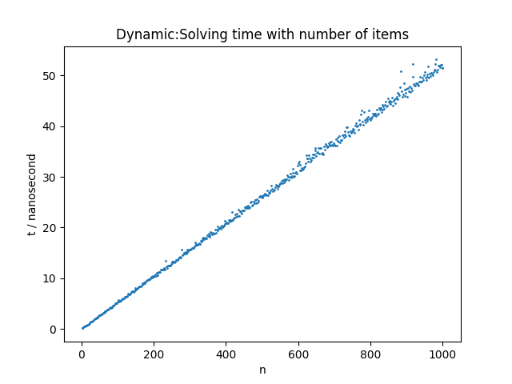
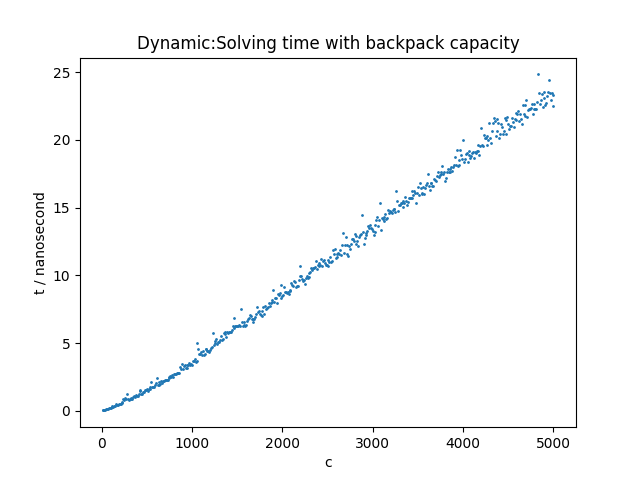
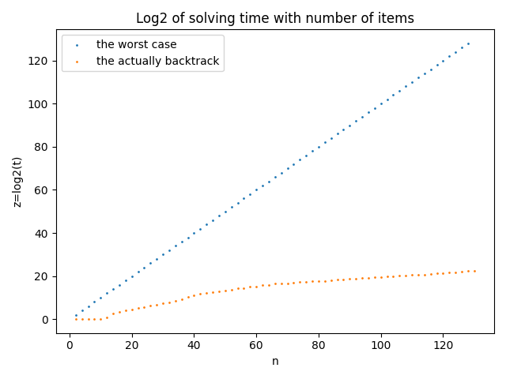
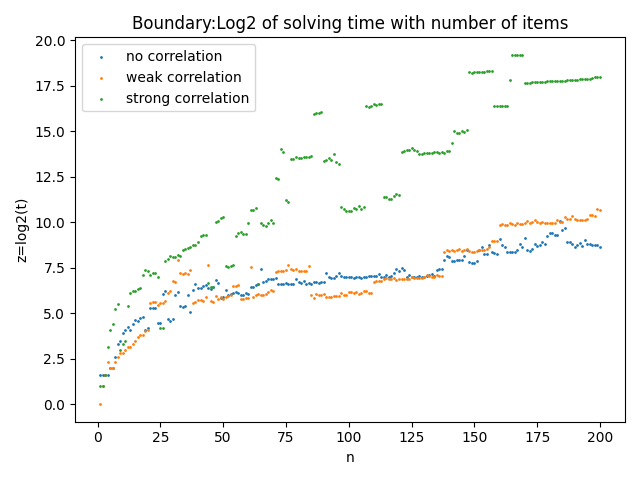
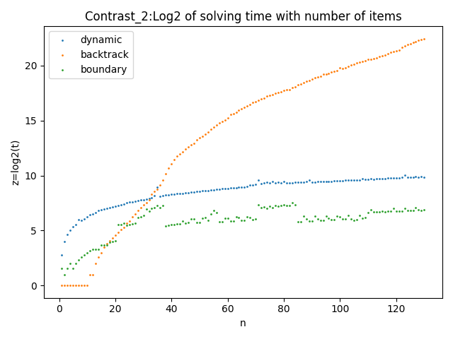

## 背包问题的三种求解算法分析

###### 注：本仓库基于天津大学算法与设计课程大作业的选题之一。仓库包含了该选题的实验代码和验证部分。

##### 摘要：本仓库主要基于0/1背包问题，对动态规划算法、回溯法（深度优先搜索）、分支限界法（使用best-first启发式搜索）的时间复杂度进行实验验证。并作比较。

#### 仓库实现以下分析：
* 动态规划算法的时间复杂度验证
  * 作出算法时间随物品数量变化的关系图
  * 作出算法时间随背包大小变化的关系图
  * 作出算法在三种相关性数据下的对比图（三条曲线，t-n）

* 回溯法的时间复杂度验证（这里的回溯是深度搜索并使用背包容量进行左支限界）
  * 原曲线和取对数后的曲线比较图（时间-物品数）
  * 作出最坏情况下和回溯法的曲线比较（时间对数-物品数）
  * 作出算法在三种相关性数据下的对比图（三条曲线，t-n）
  
* 分支限界算法的时间复杂度验证
  * 作出最坏情况、左支限界、右支限界、右支限界四条曲线对比（时间对数-物品个数）
  * 分支限界算法(左右支限界)在不同相关性数据下的对比曲线

* 三种算法性能比较
  * 在无相关数据下，三种算法的时间随物品数量变化的对比曲线
  * 在弱相关数据下，三种算法的时间随物品数量变化的对比曲线
  * 在强相关数据下，三种算法的时间随物品数量变化的对比曲线
  * 无相关大数据下(n从很小变到很大)，动态规划和分支限界算法的性能比较

#### 具体说明如下：
* 动态规划算法的时间复杂度验证
  * 作出算法时间随物品数量变化的关系图 
    实验数据:[large_scale\knapPI_1_1000_1000_1(无相关性)](large_scale/knapPI_1_1000_1000_1) 
    实验说明：物品数量从2变化到1000，步长为2，背包容量5002不变。每个数据点统计10次求解时间，取平均值。 
    曲线说明：t-n,单位纳秒 
    

  * 作出算法时间随背包大小变化的关系图 
    实验数据:[large_scale\knapPI_1_1000_1000_1(无相关性)](large_scale/knapPI_1_1000_1000_1) 
    实验说明：物品数量500不变，背包容量从10变化到5000，步长为10。每个数据点统计10次求解时间，取平均值。 
    曲线说明：t-c,单位纳秒 
    

  * 作出算法在三种相关性数据下的对比图（三条曲线，t-n） 
    实验数据: 
    1.[large_scale\knapPI_1_1000_1000_1(无相关性)](large_scale/knapPI_1_1000_1000_1) 
    2.[large_scale\knapPI_2_1000_1000_1(弱相关性)](large_scale/knapPI_2_1000_1000_1) 
    3.[large_scale\knapPI_3_1000_1000_1(强相关性)](large_scale/knapPI_2_1000_1000_1) 
    实验说明：不相关、弱相关、强相关三种数据，物品数量从2变化到1000，步长为2，背包容量5002不变。每个数据点统计10次求解时间，取平均值。 
    曲线说明：t-n,单位纳秒 
    
* 回溯法的时间复杂度验证（这里的回溯是深度搜索并使用背包容量进行左支限界）
  * 原曲线和取对数后的曲线比较图（时间-物品数） 
    实验数据:[large_scale\\knapPI_1_200_1000_1(无相关性)](large_scale/knapPI_1_200_1000_1) 
    实验说明：物品数量从2变化到130，步长为2，背包容量1008不变。每个数据点统计5次求解时间，取平均值。 
    曲线说明：t-n,t的单位纳秒；z=log2(t),z-n，t的单位为微秒 
    
  * 作出最坏情况下和回溯法的曲线比较（时间对数-物品数） 
    实验数据同上，一条是理论最坏情况下的所需时间，一条是实际时间。
    
  * 作出算法在三种相关性数据下的对比图（三条曲线，t-n） 
    实验数据: 
    1.[large_scale\\knapPI_1_200_1000_1(无相关性)](large_scale/knapPI_1_200_1000_1) 
    2.[large_scale\\knapPI_2_200_1000_1(弱相关性)](large_scale/knapPI_2_200_1000_1) 
    3.[large_scale\\knapPI_3_200_1000_1(强相关性)](large_scale/knapPI_3_200_1000_1) 
    实验说明：不相关、弱相关、强相关三种数据，物品数量从2变化到130，步长为2，背包容量1008不变。每个数据点统计5次求解时间，取平均值。 
    曲线说明：t-n,单位微秒 
      
* 分支限界算法的时间复杂度验证
  
  * 作出最坏情况、左支限界、右支限界、右支限界四条曲线对比（时间对数-物品个数） 
  
  实验数据：[large_scale\\knapPI_1_200_1000_1(数据无相关性)](large_scale/knapPI_1_200_1000_1)  

  实验说明：物品数量从1变化到30，背包容量1008保持不变，统计三种限界条件下的问题求解时间，每个数据点统计五次求平均值。

  曲线说明：曲线为z-n,其中z=log2(t),t的单位为微秒。
   .png)

  * 分支限界算法(左右支限界)在不同相关性数据下的对比曲线 
  
    实验数据： 
          1.[large_scale\\knapPI_1_200_1000_1(数据无相关性)](large_scale/knapPI_1_200_1000_1) 
          2.[large_scale\\knapPI_2_200_1000_1(数据弱相关性)](large_scale/knapPI_2_200_1000_1) 
          3.[large_scale\\knapPI_3_200_1000_1(数据强相关性)](large_scale/knapPI_3_200_1000_1) 

    实验说明：物品数量从1变化到170，背包容量1008保持不变，统计三种相关性数据下的问题求解时间，每个数据点统计五次求平均值。 
  
    曲线说明：曲线为z-n,其中z=log2(t),t的单位为微秒。 
    

* 三种算法性能比较
  * 在无相关数据下，三种算法的时间随物品数量变化的对比曲线 
    实验数据：[large_scale\knapPI_1_200_1000_1](large_scale/knapPI_1_200_1000_1) 
    实验说明：无相关数据，物品数量从1变化到130，步长为2，背包容量1008保持不变，统计三种算法解决问题的时间，每个数据点统计5次求平均值。 
    曲线说明：曲线为z-n,其中z=log2(t),t的单位为微秒。 
    

    
  * 在弱相关数据下，三种算法的时间随物品数量变化的对比曲线 
    实验数据：[large_scale\knapPI_2_200_1000_1](large_scale/knapPI_2_200_1000_1) 
    实验说明：弱相关数据，物品数量从1变化到130，步长为2，背包容量1008保持不变，统计三种算法解决问题的时间，每个数据点统计5次求平均值。 
    曲线说明：曲线为z-n,其中z=log2(t),t的单位为微秒。 
    
    
    
  * 在强相关数据下，三种算法的时间随物品数量变化的对比曲线 
    实验数据：[large_scale\knapPI_3_200_1000_1](large_scale/knapPI_3_200_1000_1) 
    实验说明：强相关数据，物品数量从1变化到130，步长为2，背包容量1008保持不变，统计三种算法解决问题的时间，每个数据点统计5次求平均值。 
    曲线说明：曲线为z-n,其中z=log2(t),t的单位为微秒。 
    
    
  * 无相关大数据下(n从很小变到很大)，动态规划和分支限界算法的性能比较 
    实验数据：[large_scale\knapPI_1_10000_1000_1](large_scale/knapPI_1_10000_1000_1) 
    实验说明：强相关数据，物品数量从10变化到10000，步长为10，背包容量49877保持不变，统计两种算法解决问题的时间，每个数据点统计1次 
    曲线说明：曲线为t-n,t的单位为纳秒。 
    
    
    

***
**注意：**
1.以上的图像中，不是取对数的t，其单位都是纳秒，取对数的t，其单位是微秒。

