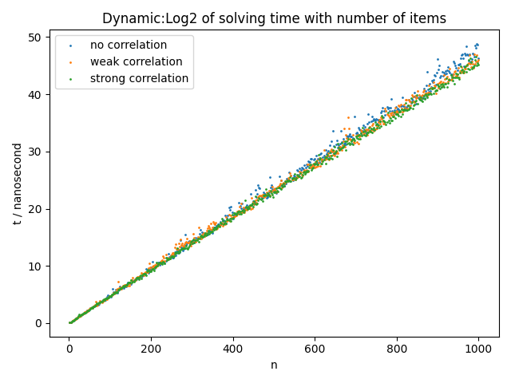

 
<h3>0/1背包问题不同求解算法的性能分析与比较</h3>

本仓库基于天津大学算法与设计课程大作业的选题之一。仓库包含了该选题的实验代码和验证部分。 

摘要：本仓库主要基于0/1背包问题，对动态规划算法、回溯法（深度优先搜索）、分支限界法（使用best-first启发式搜索）的时间复杂度进行实验验证,并作比较。同时分析数据的相关性对三种算法性能的影响  

**仓库说明：**
* 目录'large_scale'和'large_scale-optimum'是实验数据，[数据来源:点击这里](http://artemisa.unicauca.edu.co/~johnyortega/instances_01_KP/)，其中large_scale-optimum是数据对应的答案。
* 目录'test_result'是实验的测试结果。每个文件对应一种测试实验，文件中每行代表该实验的一个问题的求解，第一列是可选物品数量，第二列是背包容量，第三列是问题最优值，第四列是求解该问题的时间。
* 目录'image'是实验测试结果数据的绘图
* 源文件chart.py用于测试结果的绘图

**目录:**
- [1 动态规划算法的时间复杂度验证](#1-动态规划算法的时间复杂度验证)
  - [1.1 作出算法时间随物品数量变化的关系图](#11-作出算法时间随物品数量变化的关系图)
  - [1.2 作出算法时间随背包大小变化的关系图](#12-作出算法时间随背包大小变化的关系图)
  - [1.3 作出算法在三种相关性数据下的对比图（三条曲线，t-n）](#13-作出算法在三种相关性数据下的对比图三条曲线t-n)
- [2 回溯法的时间复杂度验证](#2-回溯法的时间复杂度验证)
  - [2.1 原曲线和取对数后的曲线比较图（时间-物品数）](#21-原曲线和取对数后的曲线比较图时间-物品数)
  - [2.2 作出最坏情况下和回溯法的曲线比较（时间对数-物品数）](#22-作出最坏情况下和回溯法的曲线比较时间对数-物品数)
  - [2.3 作出算法在三种相关性数据下的对比图（三条曲线，t-n）](#23-作出算法在三种相关性数据下的对比图三条曲线t-n)
- [3 分支限界算法的时间复杂度验证](#3-分支限界算法的时间复杂度验证)
  - [3.1 作出最坏情况、左支限界、右支限界、右支限界四条曲线对比（时间对数-物品个数）](#31-作出最坏情况左支限界右支限界右支限界四条曲线对比时间对数-物品个数)
  - [3.2 分支限界算法(左右支限界)在不同相关性数据下的对比曲线](#32-分支限界算法左右支限界在不同相关性数据下的对比曲线)
- [4 三种算法性能比较](#4-三种算法性能比较)
  - [4.1 在无相关数据下，三种算法的时间随物品数量变化的对比曲线](#41-在无相关数据下三种算法的时间随物品数量变化的对比曲线)
  - [4.2 在弱相关数据下，三种算法的时间随物品数量变化的对比曲线](#42-在弱相关数据下三种算法的时间随物品数量变化的对比曲线)
  - [4.3 在强相关数据下，三种算法的时间随物品数量变化的对比曲线 ](#43-在强相关数据下三种算法的时间随物品数量变化的对比曲线-)
  - [4.4 无相关大数据下(n从很小变到很大)，动态规划和分支限界算法的性能比较](#44-无相关大数据下n从很小变到很大动态规划和分支限界算法的性能比较)

#### 1 动态规划算法的时间复杂度验证
##### 1.1 作出算法时间随物品数量变化的关系图 
实验数据:[large_scale\knapPI_1_1000_1000_1(无相关性)](large_scale/knapPI_1_1000_1000_1) 
实验说明：物品数量从2变化到1000，步长为2，背包容量5002不变。每个数据点统计10次求解时间，取平均值。 
曲线说明：t-n,单位纳秒 

##### 1.2 作出算法时间随背包大小变化的关系图 
实验数据:[large_scale\knapPI_1_1000_1000_1(无相关性)](large_scale/knapPI_1_1000_1000_1) 
实验说明：物品数量500不变，背包容量从10变化到5000，步长为10。每个数据点统计10次求解时间，取平均值。 
曲线说明：t-c,单位纳秒 

##### 1.3 作出算法在三种相关性数据下的对比图（三条曲线，t-n） 
实验数据: 
1.[large_scale\knapPI_1_1000_1000_1(无相关性)](large_scale/knapPI_1_1000_1000_1) 
2.[large_scale\knapPI_2_1000_1000_1(弱相关性)](large_scale/knapPI_2_1000_1000_1) 
3.[large_scale\knapPI_3_1000_1000_1(强相关性)](large_scale/knapPI_2_1000_1000_1) 
实验说明：不相关、弱相关、强相关三种数据，物品数量从2变化到1000，步长为2，背包容量5002不变。每个数据点统计10次求解时间，取平均值。 
曲线说明：t-n,单位纳秒 

#### 2 回溯法的时间复杂度验证
##### 2.1 原曲线和取对数后的曲线比较图（时间-物品数） 
实验数据:[large_scale\\knapPI_1_200_1000_1(无相关性)](large_scale/knapPI_1_200_1000_1) 
实验说明：物品数量从2变化到130，步长为2，背包容量1008不变。每个数据点统计5次求解时间，取平均值。 
曲线说明：t-n,t的单位纳秒；z=log2(t),z-n，t的单位为微秒 

##### 2.2 作出最坏情况下和回溯法的曲线比较（时间对数-物品数） 
实验数据同上，一条是理论最坏情况下的所需时间，一条是实际时间。
[image/backtrack_2.png](image/backtrack_2.png)

##### 2.3 作出算法在三种相关性数据下的对比图（三条曲线，t-n） 
实验数据: 
1.[large_scale\\knapPI_1_200_1000_1(无相关性)](large_scale/knapPI_1_200_1000_1) 
2.[large_scale\\knapPI_2_200_1000_1(弱相关性)](large_scale/knapPI_2_200_1000_1) 
3.[large_scale\\knapPI_3_200_1000_1(强相关性)](large_scale/knapPI_3_200_1000_1) 
实验说明：不相关、弱相关、强相关三种数据，物品数量从2变化到130，步长为2，背包容量1008不变。每个数据点统计5次求解时间，取平均值。 
曲线说明：t-n,单位微秒 
   

#### 3 分支限界算法的时间复杂度验证

##### 3.1 作出最坏情况、左支限界、右支限界、右支限界四条曲线对比（时间对数-物品个数） 

实验数据：[large_scale\\knapPI_1_200_1000_1(数据无相关性)](large_scale/knapPI_1_200_1000_1)  

实验说明：物品数量从1变化到30，背包容量1008保持不变，统计三种限界条件下的问题求解时间，每个数据点统计五次求平均值。

曲线说明：曲线为z-n,其中z=log2(t),t的单位为微秒。
 .png)

##### 3.2 分支限界算法(左右支限界)在不同相关性数据下的对比曲线 

实验数据： 
  1.[large_scale\\knapPI_1_200_1000_1(数据无相关性)](large_scale/knapPI_1_200_1000_1) 
  2.[large_scale\\knapPI_2_200_1000_1(数据弱相关性)](large_scale/knapPI_2_200_1000_1) 
  3.[large_scale\\knapPI_3_200_1000_1(数据强相关性)](large_scale/knapPI_3_200_1000_1) 

实验说明：物品数量从1变化到170，背包容量1008保持不变，统计三种相关性数据下的问题求解时间，每个数据点统计五次求平均值。 

曲线说明：曲线为z-n,其中z=log2(t),t的单位为微秒。 

#### 4 三种算法性能比较
##### 4.1 在无相关数据下，三种算法的时间随物品数量变化的对比曲线 
实验数据：[large_scale/knapPI_1_200_1000_1](large_scale/knapPI_1_200_1000_1) 
实验说明：无相关数据，物品数量从1变化到130，步长为1，背包容量1008保持不变，统计三种算法解决问题的时间，每个数据点统计5次求平均值。 
曲线说明：曲线为z-n,其中z=log2(t),t的单位为微秒。 

##### 4.2 在弱相关数据下，三种算法的时间随物品数量变化的对比曲线 
实验数据：[large_scale\knapPI_2_200_1000_1](large_scale/knapPI_2_200_1000_1) 
实验说明：弱相关数据，物品数量从1变化到130，步长为1，背包容量1008保持不变，统计三种算法解决问题的时间，每个数据点统计5次求平均值。 
曲线说明：曲线为z-n,其中z=log2(t),t的单位为微秒。 

##### 4.3 在强相关数据下，三种算法的时间随物品数量变化的对比曲线  

实验数据：[large_scale\knapPI_3_200_1000_1](large_scale/knapPI_3_200_1000_1) 
实验说明：强相关数据，物品数量从1变化到130，步长为1，背包容量1008保持不变，统计三种算法解决问题的时间，每个数据点统计5次求平均值。 
曲线说明：曲线为z-n,其中z=log2(t),t的单位为微秒。 

##### 4.4 无相关大数据下(n从很小变到很大)，动态规划和分支限界算法的性能比较 
实验数据：[large_scale\knapPI_1_10000_1000_1](large_scale/knapPI_1_10000_1000_1) 
实验说明：不相关数据，物品数量从10变化到10000，步长为10，背包容量49877保持不变，统计两种算法解决问题的时间，每个数据点统计1次 
曲线说明：曲线为t-n,t的单位为纳秒。 

 

***
**注意：**
1.以上的图像中，不是取对数的t，其单位都是纳秒，取对数的t，其单位是微秒。
2.时间的平均值有的统计10次，有的统计5次，有的统计1次，具体见代码。
