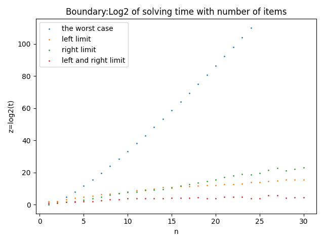

## 背包问题的三种求解算法分析

###### 注：本仓库基于天津大学算法与设计课程大作业的选题之一。仓库包含了该选题的实验代码和验证。

##### 摘要：本仓库主要基于0/1背包问题，对动态规划算法、回溯法（深度优先搜索）、分支限界法（使用best-first启发式搜索）的时间复杂度进行实验验证。并作比较。

#### 仓库实现以下分析：
* 动态规划算法的时间复杂度验证
  * 作出算法时间随物品数量变化的关系图
  * 作出算法时间随背包大小变化的关系图
  * 作出算法在三种相关性数据下的对比图（三条曲线，t-n）

* 回溯法的时间复杂度验证（这里的回溯是深度搜索并使用背包容量进行左支限界）
  * 原曲线和取对数后的曲线比较图（时间-物品数）
  * 作出最坏情况下和回溯法的曲线比较（时间对数-物品数）
  * 作出算法在三种相关性数据下的对比图（三条曲线，t-n）
  
* 分支限界算法的时间复杂度验证
  * 作出最坏情况、左支限界、右支限界、右支限界四条曲线对比（时间对数-物品个数）：
  * 分支限界算法(左右支限界)在不同相关性数据下的对比曲线

* 三种算法性能比较
  * 在无相关数据下，三种算法的时间随物品数量变化的对比曲线
  * 在弱相关数据下，三种算法的时间随物品数量变化的对比曲线
  * 在强相关数据下，三种算法的时间随物品数量变化的对比曲线

#### 具体说明如下：